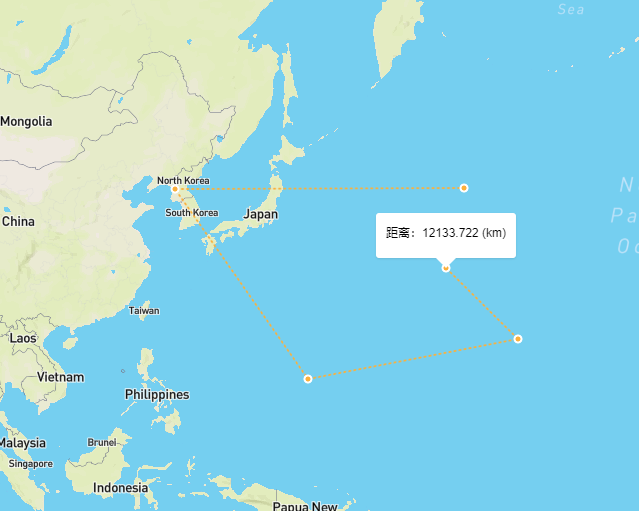
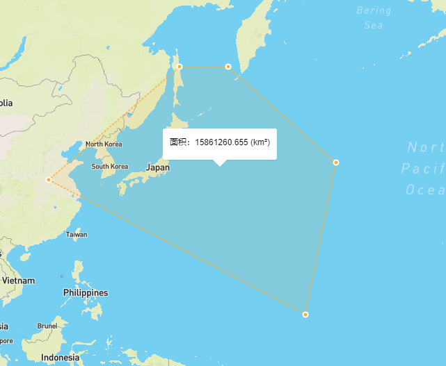

# mapboxgl-measure-tools
基于mapboxgl、mapboxgl-draw、turf测量控件

## 使用
 - CDN:
   ```js
    <!--依赖-->
    <script src="https://api.mapbox.com/mapbox-gl-js/v1.6.1/mapbox-gl.js"></script>
    <script src="https://cdn.bootcss.com/Turf.js/5.1.6/turf.js"></script>
    <script src='https://api.mapbox.com/mapbox-gl-js/plugins/mapbox-gl-draw/v1.0.9/mapbox-gl-draw.js'></script>
    <!--引用-->
    <script src="https://cdn.jsdelivr.net/npm/mapboxgl-measure-tool@1.0.5/dist/index.js"></script>
   ```
  
   ```js
    <script>
        mapboxgl.accessToken = 'pk.eyJ1IjoiamVyY2t5IiwiYSI6ImNqYjI5dWp3dzI1Y2YzMnM3eG0xNnV3bWsifQ.eQp4goc9Ng8SuEZcdgNJ_g';
        var map = new mapboxgl.Map({
            container: 'map',
            style: 'mapbox://styles/mapbox/streets-v9'
        });
          // 为了使测量图层位于最高层，在添加其他业务图层之后，再引用控件
        map.addControl(new MapMeasureTool(), 'top-right')
    </script>
   ```
  - 模块化安装
    ```
      npm install mapboxgl-measure-tool
    ```
    ```js
      import MapMesure from 'mapboxgl-measure-tool'
      mapboxgl.accessToken = 'pk.eyJ1IjoiamVyY2t5IiwiYSI6ImNqYjI5dWp3dzI1Y2YzMnM3eG0xNnV3bWsifQ.eQp4goc9Ng8SuEZcdgNJ_g';
       var map = new mapboxgl.Map({
          container: 'map',
          style: 'mapbox://styles/mapbox/streets-v9'
      });
      // 为了使测量图层位于最高层，在添加其他业务图层之后，再引用控件
      map.addControl(new MapMeasureTool(), 'top-right')

    ```
   - 注意： **避免出现测量图层被其他业务图层遮盖，需要在其他业务图层添加之后，再实例化测量控件**
   
   
## 截图
  - 测距:   
  
  - 测面：   
  
  
 
   
